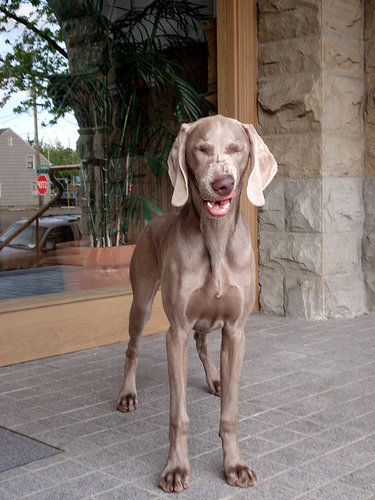

# MicroNet: Improving Image Recognition with Extremely Low FLOPs

## 目录

* [1. 简介](#1-简介)
* [2. 数据集和复现精度](#2-数据集和复现精度)
* [3. 准备数据与环境](#3-准备数据与环境)
   * [3.1 准备环境](#31-准备环境)
   * [3.2 准备数据](#32-准备数据)
* [4. 开始使用](#4-开始使用)
   * [4.1 模型训练](#41-模型训练)
   * [4.2 模型评估](#42-模型评估)
   * [4.3 模型预测](#43-模型预测)
   * [4.4 模型导出](#44-模型导出)
* [5. 代码结构](#5-代码结构)
* [6. 自动化测试脚本](#6-自动化测试脚本)
* [7. License](#7-license)
* [8. 参考链接与文献](#8-参考链接与文献)

## 1. 简介

这是一个PaddlePaddle实现的 MicroNet 。

**论文:** [MicroNet: Improving Image Recognition with Extremely Low FLOPs](https://arxiv.org/abs/2108.05894)

**参考repo:** [micronet](https://github.com/liyunsheng13/micronet)

在此非常感谢`liyunsheng13`、`PINTO0309`和`notplus`贡献的[micronet](https://github.com/liyunsheng13/micronet)，提高了本repo复现论文的效率。


## 2. 数据集和复现精度

数据集为ImageNet，训练集包含1281167张图像，验证集包含50000张图像。

```
│imagenet/
├──train/
│  ├── n01440764
│  │   ├── n01440764_10026.JPEG
│  │   ├── n01440764_10027.JPEG
│  │   ├── ......
│  ├── ......
├──val/
│  ├── n01440764
│  │   ├── ILSVRC2012_val_00000293.JPEG
│  │   ├── ILSVRC2012_val_00002138.JPEG
│  │   ├── ......
│  ├── ......
```

您可以从[ImageNet 官网](https://image-net.org/)申请下载数据。

| 模型         | epochs | top1 acc (参考精度) | (复现精度) | 权重                  \| 训练日志 |
|:-----------:|:------:|:------------------:|:---------:|:-------------------------------:|
| micronet_m0 | 600    | 46.6               | 46.6      | checkpoint-latest.pd \| log.txt |

权重及训练日志下载地址：[百度网盘](https://pan.baidu.com/s/1v4_VEQU_vyHF9j70ipCiDA?pwd=k1pa)

## 3. 准备数据与环境


### 3.1 准备环境

硬件和框架版本等环境的要求如下：

- 硬件：4 * V100
- 框架：
  - PaddlePaddle >= 2.3.1

* 安装paddlepaddle

```bash
# 安装GPU版本的Paddle
pip install paddlepaddle-gpu==2.3.1
# 安装CPU版本的Paddle
pip install paddlepaddle==2.3.1
```

更多安装方法可以参考：[Paddle安装指南](https://www.paddlepaddle.org.cn/)。

* 下载代码

```bash
git clone https://github.com/flytocc/MicroNet_paddle.git
cd MicroNet_paddle
```

* 安装requirements

```bash
pip install -r requirements.txt
```

### 3.2 准备数据

如果您已经ImageNet1k数据集，那么该步骤可以跳过，如果您没有，则可以从[ImageNet官网](https://image-net.org/download.php)申请下载。


## 4. 开始使用


### 4.1 模型训练

* 单机多卡训练

```shell
export CUDA_VISIBLE_DEVICES=0,1,2,3
python -m paddle.distributed.launch --gpus="0,1,2,3" \
    main.py \
    --model micronet_m0 \
    --batch_size 512 \
    --aa '' --smoothing 0 --train_interpolation 'bilinear' --reprob 0 \
    --mixup 0 --cutmix 0 \
    --opt momentum --weight_decay 3e-5 --min_lr 0 --warmup_epochs 0 \
    --lr 0.2 --epochs 600 \
    --data_path /path/to/imagenet/ \
    --cls_label_path_train /path/to/train_list.txt \
    --cls_label_path_val /path/to/val_list.txt \
    --output_dir output/micronet_m0/ \
    --dist_eval
```

ps: 如果未指定`cls_label_path_train`/`cls_label_path_val`，会读取`data_path`下train/val里的图片作为train-set/val-set。


部分训练日志如下所示。

```
[14:04:15.171051] Epoch: [119]  [1000/1251]  eta: 0:02:23  lr: 0.000001  loss: 1.3032 (1.2889)  time: 0.2833  data: 0.0065
[14:04:20.781305] Epoch: [119]  [1020/1251]  eta: 0:02:17  lr: 0.000001  loss: 1.3059 (1.2895)  time: 0.2794  data: 0.0118
```

### 4.2 模型评估

``` shell
python eval.py \
    --model micronet_m0 \
    --batch_size 256 \
    --train_interpolation 'bilinear' \
    --data_path /path/to/imagenet/ \
    --cls_label_path_val /path/to/val_list.txt \
    --resume $TRAINED_MODEL
```

ps: 如果未指定`cls_label_path_val`，会读取`data_path`/val里的图片作为val-set。


### 4.3 模型预测

```shell
python predict.py \
    --model micronet_m0 \
    --infer_imgs ./demo/ILSVRC2012_val_00020010.JPEG \
    --resume $TRAINED_MODEL
```

<div align="center">
    
</div>

最终输出结果为
```
[{'class_ids': [178, 690, 176, 345, 246], 'scores': [0.8150453567504883, 0.07403502613306046, 0.028849413618445396, 0.021240053698420525, 0.005981378722935915], 'file_name': './demo/ILSVRC2012_val_00020010.JPEG', 'label_names': ['Weimaraner', 'oxcart', 'Saluki, gazelle hound', 'ox', 'Great Dane']}]
```
表示预测的类别为`Weimaraner（魏玛猎狗）`，ID是`178`，置信度为`0.8150453567504883`。

### 4.4 模型导出

```shell
python export_model.py \
    --model micronet_m0 \
    --output_dir /path/to/save/export_model/ \
    --resume $TRAINED_MODEL

python infer.py \
    --train_interpolation 'bilinear' \
    --model_file /path/to/save/export_model/output/model.pdmodel \
    --params_file /path/to/save/export_model/output/model.pdiparams \
    --input_file ./demo/ILSVRC2012_val_00020010.JPEG
```

输出结果为
```
[{'class_ids': [178, 690, 176, 345, 246], 'scores': [0.8150453567504883, 0.07403502613306046, 0.028849413618445396, 0.021240053698420525, 0.005981378722935915], 'file_name': './demo/ILSVRC2012_val_00020010.JPEG', 'label_names': ['Weimaraner', 'oxcart', 'Saluki, gazelle hound', 'ox', 'Great Dane']}]
```
表示预测的类别为`Weimaraner（魏玛猎狗）`，ID是`178`，置信度为`0.8150453567504883`。与predict.py结果的误差在正常范围内。


## 5. 代码结构

```
├── demo
├── engine.py
├── eval.py
├── export_model.py
├── infer.py
├── main.py
├── models.py
├── predict.py
├── README.md
├── requirements.txt
├── test_tipc
└── util
```


## 6. 自动化测试脚本

**详细日志在test_tipc/output**

TIPC: [TIPC: test_tipc/README.md](./test_tipc/README.md)

首先安装auto_log，需要进行安装，安装方式如下：
auto_log的详细介绍参考https://github.com/LDOUBLEV/AutoLog。
```shell
git clone https://github.com/LDOUBLEV/AutoLog
cd AutoLog/
pip3 install -r requirements.txt
python3 setup.py bdist_wheel
pip3 install ./dist/auto_log-1.2.0-py3-none-any.whl
```
进行TIPC：
```bash
bash test_tipc/prepare.sh test_tipc/config/MicroNet/micronet_m0.txt 'lite_train_lite_infer'

bash test_tipc/test_train_inference_python.sh test_tipc/config/MicroNet/micronet_m0.txt 'lite_train_lite_infer'
```
TIPC结果：

如果运行成功，在终端中会显示下面的内容，具体的日志也会输出到`test_tipc/output/`文件夹中的文件中。

```
Run successfully with command - python3 main.py --model=micronet_m0 --aa='' --smoothing=0 --train_interpolation=bilinear --reprob=0 --mixup=0 --cutmix=0 --lr=0.2 --data_path=./dataset/ILSVRC2012/ --cls_label_path_train=./dataset/ILSVRC2012/train_list.txt --cls_label_path_val=./dataset/ILSVRC2012/val_list.txt --dist_eval    --output_dir=./test_tipc/output/norm_train_gpus_0_autocast_null/micronet_m0 --epochs=2     --batch_size=8 !
Run successfully with command - python3 eval.py --model=micronet_m0 --train_interpolation=bilinear --data_path=./dataset/ILSVRC2012/ --cls_label_path_val=./dataset/ILSVRC2012/val_list.txt --resume=./test_tipc/output/norm_train_gpus_0_autocast_null/micronet_m0/checkpoint-latest.pd !
Run successfully with command - python3 export_model.py --model=micronet_m0 --resume=./test_tipc/output/norm_train_gpus_0_autocast_null/micronet_m0/checkpoint-latest.pd --output=./test_tipc/output/norm_train_gpus_0_autocast_null !
......
```

* 更多详细内容，请参考：[TIPC测试文档](./test_tipc/README.md)。


## 7. License

MicroNet is released under MIT License.


## 8. 参考链接与文献
1. MicroNet: Improving Image Recognition with Extremely Low FLOPs: https://arxiv.org/abs/2108.05894
2. micronet: https://github.com/liyunsheng13/micronet